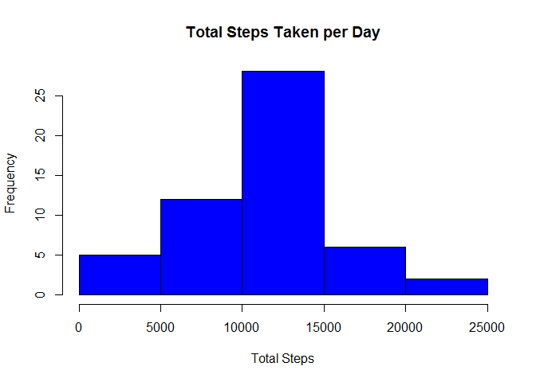
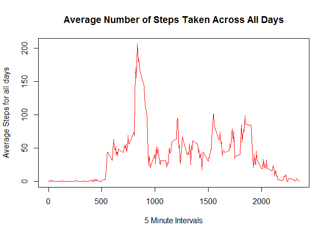
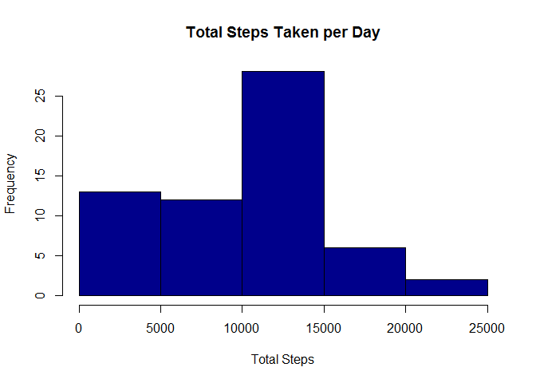
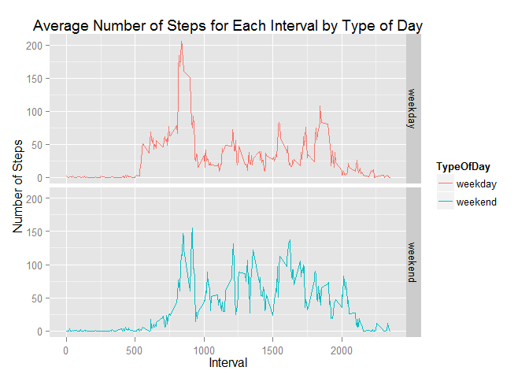

Reproducible Research Assignment 1
====================================


In order to analyze this data, I need to download it to my working desktop file and then load it into R Studio.  


```r
tf = tempfile(tmpdir=tempdir(), fileext=".zip")  
download.file("http://d396qusza40orc.cloudfront.net/repdata/data/activity.zip", tf)  
fname = unzip(tf, list=TRUE)$Name[1] 
unzip(tf, files=fname, exdir=getwd(), overwrite=TRUE) 

activity <- read.csv("activity.csv")
```


Now that I have the data loaded into R, I have four parts that I have to complete for this assignment.

## Part 1: Mean Total Number of Steps per Day

Since I have the data loaded, I need to remove all NA's, calculate the sum of steps for each day and create a historgram of that data set and then calculate the mean and median of the Total Number of Steps taken per day.


```r
activityDS <- na.omit(activity) #removing Na's
activitySumDay <- aggregate(x = activityDS$steps, FUN = sum, by = list(Group.date = activityDS$date)) #totals for each day
names(activitySumDay) <- c("date", "totalsteps") #renaming columns

hist(activitySumDay$totalsteps, col="blue", main = "Total Steps Taken per Day", xlab = "Total Steps") #creates hist
```

 


The mean total number of steps taken per day is 1.0766 &times; 10<sup>4</sup> and the median total number of steps taken per day is 10765.  


## Part 2: Average Daily Activity Pattern

In this section, I need to make a time series plot of the 5 minute intervals and the average number of steps taken, averaged across all days and show which five minute interval, on average across all days, contains the maximum number of steps.  So first, I take the original data set above that already has the NA's removed, and I aggregate the data to get the mean steps based on interval across all the dates.  Then I create a line plot depicting those mean steps by intervals throughout a day.


```r
#mean # of steps by interval time
activityMeanInterval <- aggregate(x=activityDS$steps, FUN=mean, by = list(Group.interval = activityDS$interval))
names(activityMeanInterval) <- c("interval", "meanSteps")

#line plot
plot(activityMeanInterval$interval, activityMeanInterval$meanSteps,  type="l", col="red",
     xlab="5 Minute Intervals",  ylab="Average Steps for all days", main = "Average Number of Steps Taken Across All Days")
```

 

Now that the plot is there, I can find the interval with the maximum number of steps


```r
MaxInterval <- activityMeanInterval[which.max(activityMeanInterval$meanSteps),] 
MaxInterval[,1]  
```

```
## [1] 835
```

Therefore, the five minute interval that contains the maximum number of steps is 835.  


## Part 3: Inputting Missing Values
Now I have to go back and calculate the total number of rows with missing values in the original dataset, called activity.  First, I am going to create a dataset that provides only the rows that have a NA value.  Then I will get a count of those rows.


```r
ActivityNAdata <- subset(activity, !complete.cases(activity))
nrow(ActivityNAdata)
```

```
## [1] 2304
```

So there are 2304 rows that have a NA in the original dataset.

Now that I have this dataset that contains only rows with NA values, I can now try to replace those values with the median number of steps for that interval timeframe.  So I will merge my dataset that has only rows with NA values, called ActivityNAdata, with a new dataset I create, called activityMedianInterval.


```r
activityMedianInterval <- aggregate(x=activityDS$steps, FUN=median, by = list(Group.interval = activityDS$interval))
names(activityMedianInterval) <- c("interval", "mediansteps")

#merges original dataset with only NAs with dataset of median values by interval
NAsMedianMerge <- merge(activityMedianInterval, ActivityNAdata) 
```

When I do this, I will get four columns called "interval", "mediansteps", "steps", and "date" where "steps" contains all the values = NA and the "mediansteps" column containing the median value for that interval.  I can then use the select function in the dplyr package to create a dataset that only contains the columns I need, "interval", "mediansteps" and "date" and removing the column "steps" that only have NA values.  Then I will rename the columns to match the original dataset.   


```r
#I hid messages/warnings of adding dplyr output of loaded the dplyr to my environment.  That is not needed in the document.
library("dplyr")
NAMedianMergeDS <- select(NAsMedianMerge, -steps)  #removes old column that has NA values called steps
names(NAMedianMergeDS) <- c("interval", "steps", "date") 
```

Since I renamed the columns in my dataset that replaces all NA rows with median values, I can now combine both datasets back using the rbind function.  


```r
CompleteDS <- rbind(activityDS, NAMedianMergeDS)
```

Now that I have a complete dataset with no NA's, I can now start on building a histogram that shows the total number of steps taken each day.  To do that, I first have to calculate the sum total on for each day for my new complete DS.


```r
CompleteSumDS <- aggregate(x = CompleteDS$steps, FUN = sum, by = list(Group.date = CompleteDS$date))
names(CompleteSumDS) <- c("date", "totalsteps")
```

Now that I have the total steps per day, I can plot the histogram using this dataframe. 


```r
hist(CompleteSumDS$totalsteps, col="darkblue", main = "Total Steps Taken per Day", xlab = "Total Steps")
```

 


The mean total number of steps taken per day is 9503.8689 and the median total number of steps taken per day is 10395.  

As a resut of replacing NA values as opposed to removing them altogether with this dataset, the mean and median values are different. When I replace them with the median value of steps for that interval, and then calculate mean and median again, my values are smaller.   In Part 1 where I just removed NA rows completely before calculating mean my mean was 1.0766 &times; 10<sup>4</sup> and when replacing NA's with the median interval value, my new mean is 9503.8689.  The same is true for the median values.  In part 1, I had a median value of 10765 and replacing values, I now get a median step of 10395. 

Therefore, inputting values based on the median step for that interval, reduced the number of steps overall for that person.  


## Part 4:  Differences between Weekdays and Weekends

For this part of the assignment, I need to create a new factor variable that shows whether the day is a weekday or a weekend day.  To do this, I can use the isWeekday function from the timeDate package.  First, I need to load that package.


```r
library("timeDate")
```

Now I am going to append a new column, in the 4th position as my variable to determine if it is a weekday or weekend.  I will be using the dataset that I filled-in missing values, called CompleteDS.  Using the isWeekday function, I pass in the 2nd column in my dataset which is the date column, and I tell the function that values of 1-5 are considered weekdays, which translate to Monday - Friday.  Then I convert that to a numeric value so I get a 1 if it a weekday and a 0 if it is a weekend. 


```r
CompleteDS[,4] <- as.numeric(isWeekday(CompleteDS[,2], wday=1:5))
```

After I have determined if it is a weekday or weekend day, I want to replace 1 and 0 with values "weekday" and "weekend" for ease of reading and graphing.   Once I do that, I can rename my columns and convert that column from a chr column to a factor.


```r
#substitute 1 for "weekday" and 0 for "weekend"
CompleteDS[,4] <- sub("^1", "weekday", CompleteDS[,4])
CompleteDS[,4] <- sub("^0", "weekend", CompleteDS[,4])
names(CompleteDS) <- c("steps", "date", "interval", "TypeOfDay")
CompleteDS$TypeOfDay <- as.factor(CompleteDS$TypeOfDay)
```

Now that I can determine what days are weekend days and which ones are weekdays, I can work to create my panel plot depicting a time series plot of the average number of steps taken across weekends and weekdays by creating a dataset that summarizes that. 


```r
CompleteMeanData <- aggregate(CompleteDS$steps, list(CompleteDS$interval, CompleteDS$TypeOfDay), mean)
names(CompleteMeanData) <- c("interval", "TypeOfDay", "meanSteps")
```

Now that I have aggregated the data by interval and Type of Day to get the mean steps, I can plot this using the ggplot package and get my graph that shows the Average Number of Steps by Interval for Weekdays and Weekend days.


```r
library(ggplot2)
ggplot(CompleteMeanData, aes(x=interval, y=meanSteps, col=TypeOfDay)) + geom_line() + facet_grid(TypeOfDay ~ .) +
  labs(y="Number of Steps", x="Interval", title="Average Number of Steps for Each Interval by Type of Day")
```

 
